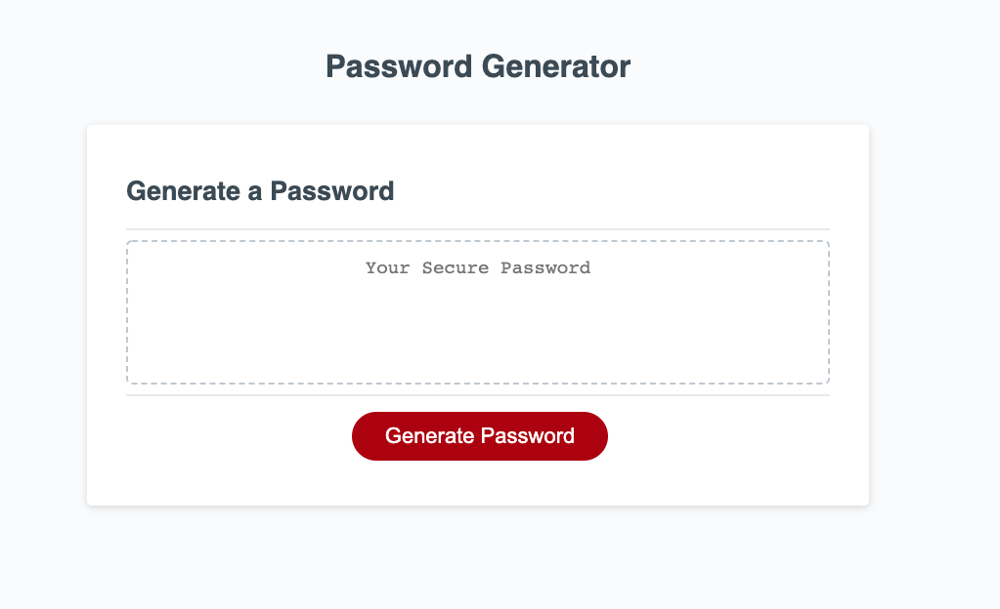

# Responsive Portfolio Design

## General info
Create an application that generates a random password based on user-selected criteria. This app will run in the browser and feature dynamically updated HTML and CSS powered by your JavaScript code. It will also feature a clean and polished user interface and be responsive, ensuring that it adapts to multiple screen sizes

## Features

* Password can be between 8 and 128 characters in length.
* Password can contain the following:
  * Upper case letters
  * Lower case letters
  * Numbers
  * Symbols
* Password must include one of the above following items

	
## Technologies
Project is created with:
* Javascript
* CSS
* HTML